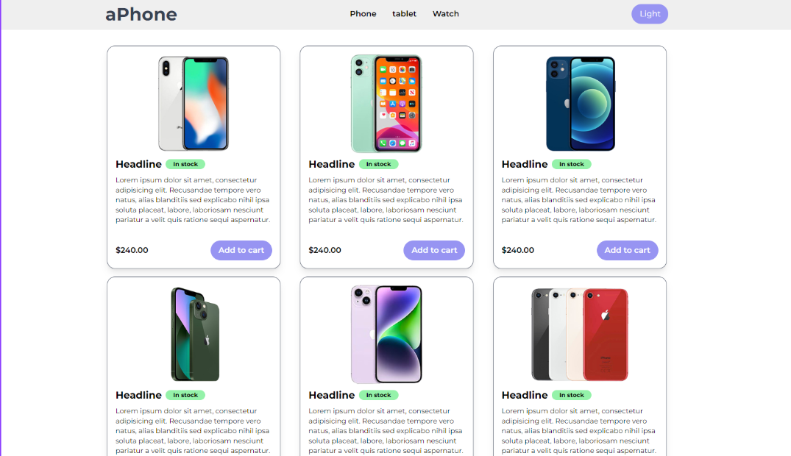

# Tailwind CSS Practice Project (Tailwind CSS v4)

This repository is for **practicing TailwindCSS v4** by cloning a provided UI design.  
Your task is to **recreate the sample UI as close as possible** using **Node.js and TailwindCSS v4 CLI**.

---

## 🖼 Sample UI (Reference)

Below is the UI that you need to clone using Tailwind CSS.



> ⚠️ The goal is **visual accuracy** — layout, spacing, typography, colors, and responsiveness.

---

## 📁 Project Structure

```
tailwindcss-practice/
├── node_modules/          # Dito nakalagay lahat ng installed libraries (npm install)
├── public/                # Final output folder
│   └── css/
│       └── output.css       # Compiled CSS (Eto yung naka-link sa HTML)
├── src/                   # Source folder (Dito ka mag-e-edit)
│   ├── css/
│   │   └── input.css       # Raw CSS na may @import "tailwindcss"
│   └── img/               # Images folder
│       ├── iphone-7.png
│   └── index.html         # Main HTML file
├── package.json           # Project manifest / metadata
└── package-lock.json      # Version history ng mga installed packages
```

---

## 🎯 Objective

- Clone the UI shown in **`task-tailwind.png`**
- Use **Tailwind CSS v4 (CLI)** only
- Do **NOT** use other UI frameworks (Bootstrap, Material UI, etc.)
- Apply responsive design principles
- Use semantic HTML

---

## 🛠 Requirements

Make sure you have the following installed:

- **Node.js** (v18 or later recommended)
- **npm**

---

## 🚀 Getting Started

### 1️⃣ Clone the Repository

```bash
git clone https://github.com/enehry/tailwindcss-practice.git
cd tailwindcss-practice
```

---

### 2️⃣ Initialize Node.js

```bash
npm init -y
```

---

### 3️⃣ Install Tailwind CSS v4 (CLI)

```bash
npm install -D tailwindcss @tailwindcss/cli
```

---

### 4️⃣ Create Tailwind Input File

Create `src/css/input.css`:

```css
@import "tailwindcss";
```

> Tailwind CSS v4 uses a **single import** instead of `@tailwind base/components/utilities`.

---

### 5️⃣ Create Your HTML File

Create `src/index.html` and link the output CSS:

```html
  <link href="../public/css/output.css" rel="stylesheet">
```

---

### 6️⃣ Build Tailwind CSS

Run the Tailwind CLI:

```bash
npx tailwindcss -i ./src/css/input.css -o ./public/css/output.css --watch
```

This command will:

- Generate `output.css`
- Watch for changes automatically

---

## 🧩 Development Guidelines

- All HTML files must be inside the `src/` folder
- Use images from the `img/` directory
- Match the sample UI in terms of:
  - Layout
  - Spacing
  - Colors
  - Typography
  - Responsive behavior

---

## 📱 Assets

- **`img/`** → Contains **7 iPhone images**
- **`task-tailwind.png`** → UI reference to clone

---

## 📌 Rules

- ✅ Tailwind utility classes only
- ❌ No custom CSS unless absolutely necessary
- ❌ No external CSS frameworks
- ✅ Semantic HTML required

---

## 📦 Optional NPM Script

Add this to your `package.json`:

```json
"scripts": {
  "dev": "tailwindcss -i ./src/css/input.css -o ./public/css/output.css --watch"
}
```

Then run:

```bash
npm run dev
```

---

## 🏁 Learning Outcomes

By completing this exercise, you should be comfortable with:

- Tailwind CSS v4 workflow
- Utility-first styling
- Responsive layouts
- Translating UI designs into code

---

Happy coding 🚀  
Practice. Observe. Improve.
